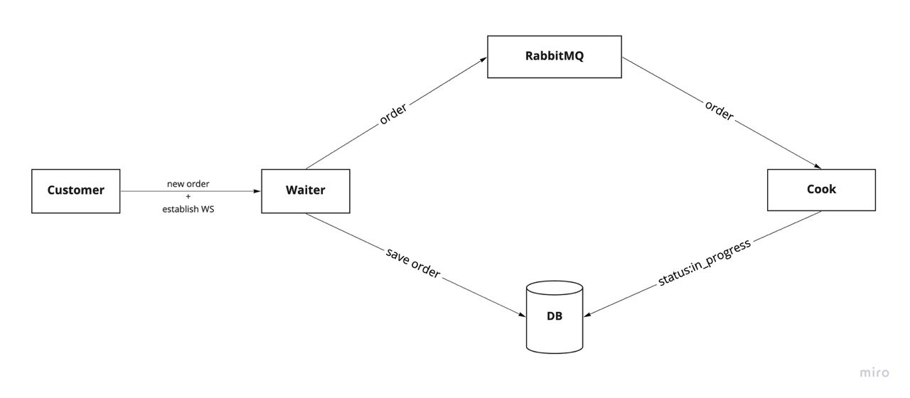
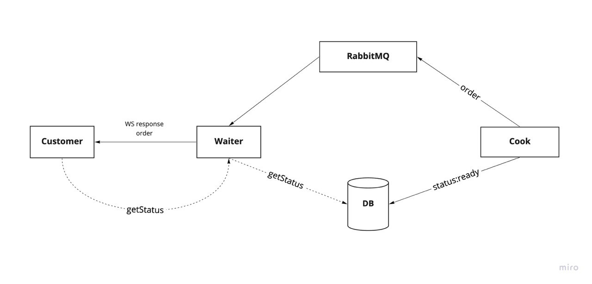

# Pizzashop

## Setup

You can run the project with docker-compose:
```
docker-compose up -d
```
## Usage

Docker compose exposes a customer instance on port 3000. A customer endpoint `/makeOrder` triggers a customer to make a sample order and return order id in response. 
```
curl http://localhost:3000/makeOrder
```
This will output a response like
```
{"id":"5d63d991dee4aa40d7df2e63"}
```
You can then use this id to request order status:
```
curl http://localhost:3000/orderStatus/5d63d991dee4aa40d7df2e63
```
## Architecture
The flow for new order looks like this:
Customer sends order request to waiter, then waiter save this order to database and puts its id in the queue 'newOrders' in RabbitMQ. After that a cook processes the order and puts it in the 'readyOrders' queue for waiter to consume.

### New order flow


### Ready order flow and getStatus

